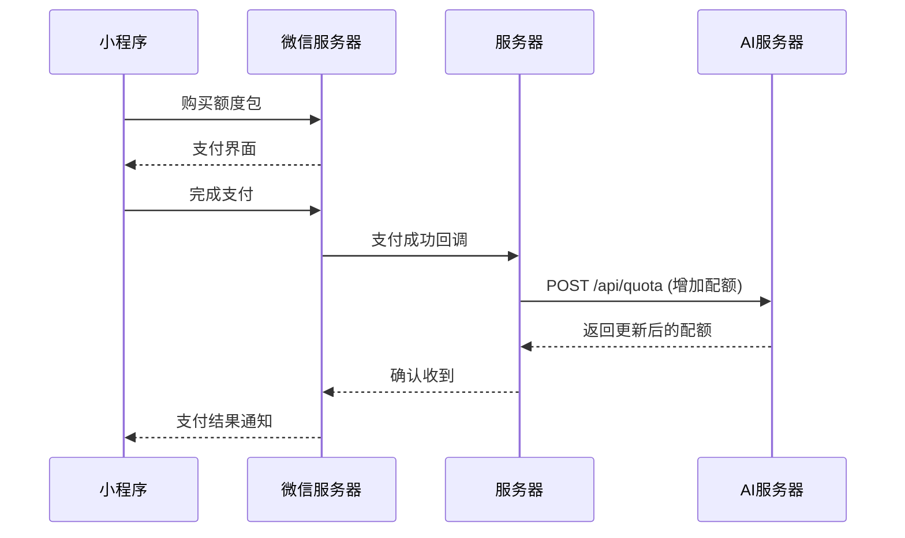
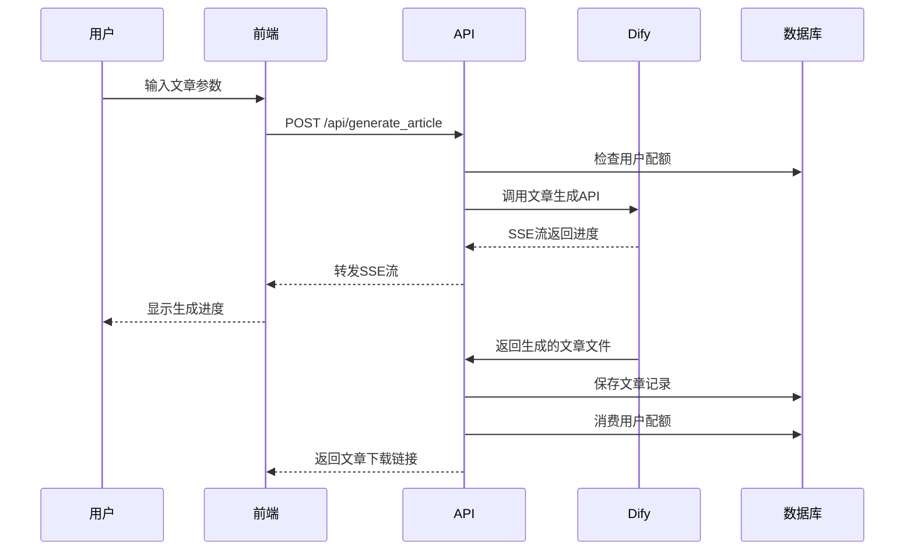

# 医路达 API 系统

基于 Next.js 的智能医疗科普文章生成平台，集成 AI 服务、用户配额管理、文章存储等完整功能。

## 🎯 项目概述

医路达 API 系统是一个专为医疗科普内容创作设计的智能平台，主要功能包括：

- **AI 标题生成**：基于医疗方向和需求智能生成文章标题
- **AI 文章生成**：根据标题和参数生成完整的医疗科普文章
- **用户配额管理**：完整的用户服务配额系统，支持购买和消费跟踪
- **文章存储管理**：文章的云存储、检索、预览和删除功能
- **JWT 认证系统**：基于角色的权限控制和用户认证
- **Web 界面**：现代化的 React 前端界面，支持实时进度显示

## 🏗️ 系统架构

### 技术栈
- **前端**: Next.js 15, React 19, TypeScript, Tailwind CSS
- **后端**: Next.js API Routes, Node.js
- **数据库**: Supabase (PostgreSQL)
- **存储**: Supabase Storage
- **AI 服务**: Dify API 集成
- **认证**: JWT (JSON Web Tokens)
- **部署**: Docker, Docker Compose

### 项目结构

```
yilu-api/
├── src/
│   ├── app/                    # Next.js App Router
│   │   ├── api/               # API 路由
│   │   │   ├── generate_titles/    # 标题生成 API
│   │   │   ├── generate_article/   # 文章生成 API
│   │   │   ├── articles/           # 文章管理 API
│   │   │   ├── quota/              # 配额管理 API
│   │   │   ├── jwt/                # JWT 认证 API
│   │   │   ├── auth/               # 用户认证 API
│   │   │   └── tokens/             # 系统令牌管理
│   │   ├── article-generator/      # 文章生成器页面
│   │   │   └── components/         # React 组件
│   │   ├── layout.tsx             # 全局布局
│   │   └── page.tsx               # 首页
│   ├── hooks/                     # React Hooks
│   │   ├── useArticleGeneration.ts
│   │   ├── useTitleGeneration.ts
│   │   ├── useArticleHistory.ts
│   │   └── usePreviewModal.ts
│   ├── types/                     # TypeScript 类型定义
│   │   └── index.ts
│   └── utils/                     # 工具函数
│       ├── dify.ts               # Dify API 集成
│       ├── quota.ts              # 配额管理
│       ├── jwt.ts                # JWT 处理
│       ├── article_storage.ts    # 文章存储
│       ├── supabase.ts           # 数据库连接
│       ├── apiAuth.ts            # API 认证
│       └── task-manager.ts       # 任务管理
├── public/                        # 静态文件
│   ├── test-unified.html         # 统一测试页面
│   ├── article-generator.html    # 文章生成器（独立版本）
│   └── ...                       # 其他测试页面
├── docker-compose.yml            # Docker 编排配置
├── Dockerfile                    # Docker 镜像配置
├── supabase-schema.sql          # 数据库架构
├── test-*.js                    # 测试脚本
└── README-*.md                  # 专项文档
```

## 📱 小程序集成指南

### 文章生成API接口详解

本系统专为小程序集成设计，支持断点续传和实时进度显示。

#### 1. 文章生成接口

**端点**: `POST /api/generate_article`

**请求参数**:
```json
{
  "userid": "用户ID",
  "direction": "健康科普",
  "title": "文章标题",
  "word_count": 1500,
  "name": "作者姓名",
  "unit": "科室名称",
  "style": "生动有趣，角度新颖",
  "journal": "健康向导",
  "outline": "文章大纲内容"
}
```

**响应**:
- Content-Type: `text/event-stream`
- 响应头包含任务ID: `X-Task-ID: task-1234567890-abcde`

**SSE事件流格式**:
```javascript
// 任务开始
data: {"event":"workflow_started","task_id":"task-1234567890-abcde","data":{"progress":"0"}}

// 任务进行中
data: {"event":"workflow_running","task_id":"task-1234567890-abcde","data":{"progress":"25","title":"读取资料中..."}}

// 文本片段输出
data: {"event":"text_chunk","task_id":"task-1234567890-abcde","data":{"text":"范畴，认为","title":"文章撰写中"}}

// 任务完成
data: {"event":"workflow_finished","task_id":"task-1234567890-abcde","data":{"progress":"100","files":[{"url":"http://example.com/files/document.docx"}]}}
```

#### 2. 任务状态查询接口

**基本状态查询**:
```
GET /api/article_status?task_id={taskId}&user_id={userId}
```

**响应**:
```json
{
  "id": "task-1234567890-abcde",
  "userId": "user123",
  "serviceType": "all",
  "status": "running",
  "progress": 75,
  "statusTitle": "正在撰写文章..",
  "eventCount": 150,
  "updatedAt": 1746864043148,
  "createdAt": 1746863990783
}
```

**完整历史查询**:
```
GET /api/article_status?task_id={taskId}&user_id={userId}&include_history=true
```

**增量事件查询（断点续传）**:
```
GET /api/article_status?task_id={taskId}&user_id={userId}&last_event_index={timestamp}
```

**响应**:
```json
{
  "events": [
    {"event":"workflow_running","task_id":"task-1234567890-abcde","timestamp":1746864010123,"data":{"progress":"50"}},
    {"event":"workflow_running","task_id":"task-1234567890-abcde","timestamp":1746864020456,"data":{"progress":"75"}}
  ],
  "lastIndex": 1746864020456
}
```

#### 3. 断点续传工作流程

1. **初始生成**:
   - 调用 `POST /api/generate_article` 开始生成
   - 从响应头获取 `X-Task-ID` 并保存
   - 处理SSE事件流

2. **连接中断**:
   - 记录最后收到的事件时间戳

3. **恢复生成**:
   - 调用增量事件查询接口获取新事件
   - 使用返回的 `lastIndex` 作为下次请求的 `last_event_index`

4. **定期轮询**:
   - 周期性调用增量事件查询接口获取最新事件

#### 4. 事件类型说明

| 事件类型 | 说明 | 包含字段 |
|---------|------|---------|
| workflow_started | 任务开始 | progress |
| workflow_running | 任务运行中 | progress, title, content, workflow_run_id, workflow_id, status |
| text_chunk | 文本片段输出 | text, from_variable_selector, title, workflow_run_id |
| workflow_finished | 任务完成 | progress, files |
| error | 发生错误 | error |

#### 5. 小程序集成示例

```javascript
// 初始生成请求
wx.request({
  url: 'https://your-api.com/api/generate_article',
  method: 'POST',
  header: { 'Content-Type': 'application/json' },
  data: {
    userid: 'user123',
    direction: '健康科普',
    title: '健康饮食指南',
    word_count: 1500,
    name: '张医生',
    unit: '营养科',
    style: '生动有趣'
  },
  success: (res) => {
    const taskId = res.header['X-Task-ID'];
    // 保存taskId用于后续查询
    this.startPolling(taskId);
  }
});

// 状态轮询
startPolling(taskId) {
  const poll = () => {
    wx.request({
      url: `https://your-api.com/api/article_status?task_id=${taskId}&user_id=user123&last_event_index=${this.lastEventIndex}`,
      success: (res) => {
        if (res.data.events) {
          res.data.events.forEach(event => {
            this.handleEvent(event);
          });
          this.lastEventIndex = res.data.lastIndex;
        }

        // 如果任务未完成，继续轮询
        if (res.data.status !== 'completed' && res.data.status !== 'failed') {
          setTimeout(poll, 2000);
        }
      }
    });
  };
  poll();
}
```

## 🤖 Dify AI 集成详解

### Dify 服务架构

系统集成了 Dify AI 平台，提供智能内容生成能力：

#### 1. 配置管理

**环境变量配置**:
```bash
# 标题生成专用API密钥
TITLES_DIFY_API_KEY=app-HCeGiaG645S3iQprJr6AKgvv

# 文章生成专用API密钥
ARTICLE_DIFY_API_KEY=app-6OQh6LGcITK6CMB1V1q9BlYQ

# Dify服务地址
DIFY_BASE_URL=http://sandboxai.jinzhibang.com.cn
DIFY_API_URL=http://sandboxai.jinzhibang.com.cn/v1
```

**配置函数**:
- `getDifyConfig()`: 获取标题生成配置
- `getArticleDifyConfig()`: 获取文章生成配置

#### 2. API调用流程

**标题生成流程**:
1. 构建请求参数（方向、用户ID等）
2. 调用 Dify Workflow API
3. 处理 SSE 响应流
4. 解析并转发事件到前端

**文章生成流程**:
1. 构建详细请求参数（标题、风格、大纲等）
2. 创建任务跟踪记录
3. 调用 Dify Workflow API
4. 实时处理和转发事件
5. 自动保存生成的文章文件

#### 3. 事件处理机制

**SSE事件解析**:
```typescript
interface DifyEventData {
  event?: string;
  task_id?: string;
  workflow_run_id?: string;
  data?: {
    workflow_id?: string;
    progress?: string;
    status?: string;
    title?: string;
    content?: string;
    files?: Array<FileData>;
    elapsed_time?: number | string;
  };
}
```

**事件类型处理**:
- `workflow_started`: 初始化任务状态
- `workflow_running`: 更新进度和状态标题
- `text_chunk`: 处理文本片段输出
- `workflow_finished`: 处理完成事件和文件保存
- `error`: 错误处理和用户反馈

#### 4. 文件处理和存储

**文件自动保存**:
1. 检测 `workflow_finished` 事件中的文件URL
2. 从 Dify 下载文件内容
3. 上传到 Supabase Storage
4. 更新数据库记录
5. 返回新的公开访问URL

**存储路径规则**:
```
articles/{userId}/{安全文件名}.{扩展名}
```

#### 5. 错误处理和重试

**网络错误处理**:
- 连接超时自动重试
- 解析错误的容错处理
- 不完整JSON的修复尝试

**业务错误处理**:
- API密钥验证失败
- 工作流执行失败
- 文件生成失败

#### 6. 性能优化

**流式处理优化**:
- 实时事件转发，减少延迟
- 缓冲区管理，避免数据丢失
- 内存使用优化

**任务管理优化**:
- 任务状态持久化
- 断点续传支持
- 自动清理过期任务

## 📡 完整 API 端点参考

### 核心生成 API

#### 1. 标题生成 API
**端点**: `POST /api/generate_titles`

**请求参数**:
```json
{
  "userid": "wx_abcd1234efgh5678",
  "direction": "心血管疾病预防与保健",
  "word_count": 15,
  "name": "张医生",
  "unit": "北京协和医院心内科"
}
```

**响应**: SSE流，实时返回生成进度和标题结果。

#### 2. 文章生成 API
详见上方"小程序集成指南"章节的完整说明。

#### 3. 任务状态查询 API
**端点**: `GET /api/article_status`

详见上方"小程序集成指南"章节的完整说明。

### 管理 API

#### 4. 文章管理 API

**获取文章列表**:
```
GET /api/articles?user_id={userId}&limit={limit}&offset={offset}
```

**删除文章**:
```
DELETE /api/articles?user_id={userId}&article_id={articleId}
```

需要 JWT 认证或 API 密钥。

#### 5. 配额管理 API

**查询配额**:
```
GET /api/quota?user_id={userId}&service_id={serviceId}
```

**添加配额**:
```
POST /api/quota
```
```json
{
  "user_id": "user123",
  "service_id": "generate_article",
  "amount": 10
}
```

### 认证 API

#### 6. JWT 认证 API

**生成令牌**:
```
POST /api/jwt/generate
```
```json
{
  "userId": "user123",
  "role": "customer",
  "expiresIn": "3600s"
}
```

**验证令牌**:
```
POST /api/jwt/verify
```
```json
{
  "token": "eyJhbGciOiJIUzI1NiIs..."
}
```

#### 7. 用户认证 API

**用户登录**:
```
POST /api/auth
```
```json
{
  "username": "admin",
  "password": "admin123"
}
```

#### 8. 系统令牌管理 API

**生成系统令牌**:
```
POST /api/tokens/system
```

**查询用户令牌**:
```
GET /api/tokens/userid/{userId}
```

## 🗄️ 数据库设计

系统使用 Supabase PostgreSQL 数据库，主要包含以下表：

### user_service_quota 表
用户服务配额管理
- `id`: 主键
- `user_id`: 用户ID
- `service_id`: 服务类型 (generate_title, generate_article)
- `remaining_quota`: 剩余配额
- `created_at`, `updated_at`: 时间戳

### article_records 表
文章记录管理
- `id`: 主键
- `user_id`: 用户ID
- `direction`: 文章方向
- `word_count`: 字数
- `author_name`: 作者姓名
- `unit`: 单位
- `title`: 文章标题
- `file_path`: 文件路径
- `public_url`: 公开访问URL
- `dify_task_id`: Dify任务ID
- `style`, `journal`, `outline`: 文章属性

### quota_logs 表
配额操作日志
- `id`: 主键
- `user_id`: 用户ID
- `service_id`: 服务类型
- `operation`: 操作类型 (add/use)
- `amount`: 操作数量
- `balance`: 操作后余额
- `operator`: 操作者

### system_tokens 表
系统令牌管理
- `id`: 主键
- `name`: 令牌名称
- `token`: 令牌值
- `created_by`: 创建者
- `description`: 描述

## ⚙️ 环境配置

### 环境变量

创建 `.env.local` 文件并配置以下环境变量：

```bash
# Dify API 配置
TITLES_DIFY_API_KEY=app-HCeGiaG645S3iQprJr6AKgvv
ARTICLE_DIFY_API_KEY=app-6OQh6LGcITK6CMB1V1q9BlYQ
DIFY_BASE_URL=http://sandboxai.jinzhibang.com.cn
DIFY_API_URL=http://sandboxai.jinzhibang.com.cn/v1

# Supabase 配置
SUPABASE_URL=http://ai.jinzhibang.com.cn:8000
SUPABASE_ANON_KEY=eyJhbGciOiJIUzI1NiIsInR5cCI6IkpXVCJ9...

# JWT 配置
JWT_SECRET=your-very-secure-jwt-secret-key-for-yilu-api-quota-management
JWT_EXPIRY=1h

# 配额 API 密钥
QUOTA_API_KEY=your-secure-api-key

# 开发设置
NODE_ENV=development
USE_MOCK_DATA=false
SKIP_QUOTA_CHECK=false
```

### 用户角色和权限

系统定义了三种用户角色：

1. **admin** - 管理员角色
   - 权限：`quota:read`, `quota:write`, `quota:delete`, `user:manage`, `article:read`, `article:write`, `article:delete`

2. **system** - 系统服务角色
   - 权限：`quota:read`, `quota:write`, `article:read`, `article:write`, `article:delete`

3. **customer** - 普通用户角色
   - 权限：`quota:read`, `article:read`

## 🚀 部署指南

### 方式1: 本地开发

1. **克隆项目并安装依赖**
```bash
git clone <repository-url>
cd yilu-api
npm install
```

2. **配置环境变量**
```bash
cp .env.example .env.local
# 编辑 .env.local 文件，填入正确的配置
```

3. **初始化数据库**
```bash
# 在 Supabase 管理界面执行 supabase-schema.sql 中的 SQL 语句
```

4. **启动开发服务器**
```bash
npm run dev
```

服务器将在 http://localhost:9090 启动。

### 方式2: Docker 部署

1. **使用 Docker Compose（推荐）**
```bash
# 构建并启动服务
docker-compose up -d

# 查看日志
docker-compose logs -f yilu-api

# 停止服务
docker-compose down
```

2. **手动 Docker 部署**
```bash
# 构建镜像
docker build -t yilu-api .

# 运行容器
docker run -d \
  --name yilu-api \
  -p 9090:9090 \
  -e DIFY_API_KEY=your_api_key \
  -e SUPABASE_URL=your_supabase_url \
  yilu-api
```

详细部署说明请参考 [DEPLOYMENT.md](./DEPLOYMENT.md)。

## 🧪 测试和开发

### 测试页面

系统提供了多个测试页面：

1. **统一测试平台**: http://localhost:9090/test-unified.html
   - 包含所有功能的综合测试界面
   - 支持文章生成、标题生成、配额管理、JWT 测试

2. **文章生成器**: http://localhost:9090/article-generator
   - React 版本的文章生成器
   - 现代化 UI，支持实时预览

3. **独立测试页面**:
   - `/test.html` - 基础 API 测试
   - `/test-article.html` - 文章生成测试
   - `/test-jwt.html` - JWT 功能测试

### 命令行测试

```bash
# 测试标题生成 API
node test-api.mjs

# 测试文章管理 API
node test-articles.js

# 测试配额管理 API
node test-quota.js
```

## 🔧 核心功能详解

### 1. AI 内容生成流程

**标题生成**:
1. 用户输入医疗方向、字数要求等参数
2. 系统检查用户配额
3. 调用 Dify API 生成标题候选
4. 通过 SSE 实时返回生成进度
5. 消费用户配额（仅在成功时）

**文章生成**:
1. 用户选择标题并设置文章参数
2. 系统创建任务并检查配额
3. 调用 Dify API 生成文章内容
4. 实时显示生成进度和状态
5. 自动保存生成的文章到 Supabase Storage
6. 记录文章元数据到数据库

### 2. 配额管理机制

- **配额检查**: 每次服务调用前检查用户剩余配额
- **配额消费**: 仅在服务成功完成时消费配额
- **配额添加**: 支持管理员和系统服务添加用户配额
- **操作日志**: 记录所有配额变更操作，便于审计

### 3. 文章存储系统

- **云存储**: 使用 Supabase Storage 存储文章文件
- **元数据管理**: 数据库记录文章的详细信息
- **文件预览**: 支持 DOCX 文件在线预览
- **权限控制**: 用户只能访问自己的文章

### 4. 任务管理系统

- **任务跟踪**: 为长时间运行的任务提供状态跟踪
- **断点续传**: 支持任务中断后的状态恢复
- **进度显示**: 实时显示任务执行进度
- **错误处理**: 完善的错误处理和用户反馈

## 📊 业务流程

### 用户购买配额流程


### 文章生成流程


## 🛠️ 开发指南

### 添加新的 API 端点

1. 在 `src/app/api/` 下创建新的路由文件夹
2. 实现 `route.ts` 文件，导出 HTTP 方法处理函数
3. 添加必要的类型定义到 `src/types/index.ts`
4. 实现相关的工具函数到 `src/utils/`
5. 添加测试用例

### 前端组件开发

1. 在 `src/app/article-generator/components/` 下创建新组件
2. 使用 TypeScript 和 Tailwind CSS
3. 创建对应的 Hook 在 `src/hooks/` 目录
4. 遵循现有的组件结构和命名规范

### 数据库变更

1. 修改 `supabase-schema.sql` 文件
2. 在 Supabase 管理界面执行 SQL 变更
3. 更新相关的 TypeScript 类型定义
4. 测试数据库操作功能

## 🔍 故障排除

### 常见问题

1. **容器无法启动**
   ```bash
   # 检查日志
   docker-compose logs yilu-api

   # 检查端口占用
   lsof -i :9090
   ```

2. **API 返回错误**
   - 检查环境变量配置
   - 确认 Dify API 密钥有效
   - 验证 Supabase 连接

3. **配额检查失败**
   - 检查数据库连接
   - 验证用户配额记录
   - 查看配额日志

4. **文章生成超时**
   - 检查 Dify 服务状态
   - 查看任务管理器状态
   - 检查网络连接

### 日志查看

```bash
# Docker 环境
docker-compose logs -f yilu-api

# 本地开发
npm run dev

# 查看特定时间段的日志
docker-compose logs --since="2024-01-01T00:00:00" yilu-api
```

## 📚 相关文档

- [小程序集成指南](./miniprogram-guide.md) - 详细的API接口文档和断点续传实现
- [文章存储系统文档](./README-articles.md) - 文章存储和管理系统详解
- [配额管理系统文档](./README-quota.md) - 用户配额管理系统详解
- [部署指南](./DEPLOYMENT.md) - Docker部署和生产环境配置

